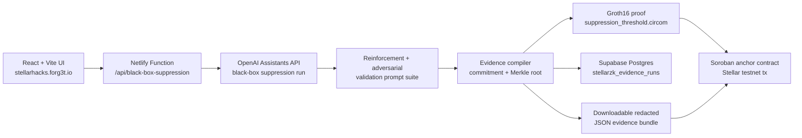

# Forg3t StellarZK

Forg3t StellarZK is a hackathon-focused version of Forg3t Protocol for **Stellar Hacks: Real-World ZK**.

It turns an AI deletion workflow into a private proof receipt and a Stellar-ready attestation package. The product goal is simple: prove that a scoped AI system stopped surfacing sensitive data without publishing the sensitive target itself.

## Demo

- Live app: https://stellarhacks.forg3t.io
- Demo video: https://youtu.be/VyWUI4u_4k0
- Submission notes: `docs/dorahacks-submission.md`

## Why This Exists

Everyone is building AI to remember. Forg3t is building the proof layer for AI to forget.

Record deletion is not enough for enterprise AI. The hard part is proving that an AI workflow no longer retrieves, repeats, or exposes the scoped data. Forg3t compiles that workflow into redacted evidence, commitments, validation signals, and anchor metadata.

## What Works

- Operator-grade React UI based on the Forg3t Avax control-plane design language
- Server-side Netlify Function for live OpenAI Assistant black-box suppression
- Real Assistant policy injection, reinforcement prompts, adversarial prompts, and leak-score measurement
- Optional Supabase persistence for redacted evidence runs through `stellarzk_evidence_runs`
- Real WebCrypto SHA-256 target commitments
- Merkle evidence root generation
- Editable private witness inputs
- Groth16 proof generation and verification from committed Circom artifacts
- Downloadable JSON evidence bundle
- Local JSON hash verification
- Real Stellar testnet anchor submission from the live Netlify Function
- Circom threshold circuit source and generated `zk-artifacts`
- Soroban anchor contract source, deployed testnet contract, and smoke invoke transaction

No fake transaction hashes, fake OpenAI runs, or fake Supabase inserts are emitted. If a key is missing, the app asks for it or returns a clear server error.

## Tech Architecture



The frontend never receives `OPENAI_API_KEY`, `SUPABASE_SERVICE_ROLE_KEY`, raw Assistant prompts, raw Assistant responses, or the private target after the server-side run. The exported bundle contains commitments, aggregate scores, Merkle leaves, proof receipt metadata, and Stellar anchor metadata.

## Quick Start

```bash
npm install
npm run dev
```

Use the same public Supabase env values as the existing Forg3t app:

```bash
cp .env.example .env
```

Then set:

```bash
VITE_SUPABASE_URL=...
VITE_SUPABASE_ANON_KEY=...
```

For Supabase persistence, set these only in Netlify or a server-side local environment:

```bash
SUPABASE_URL=...
SUPABASE_SERVICE_ROLE_KEY=...
```

The public demo asks for the OpenAI Assistant ID and API key at run time. The key is sent only to the Netlify Function for that suppression run and is not stored in the repo, browser bundle, or Supabase evidence row.

Build:

```bash
npm run build
```

## Live ZK + Stellar Path

The live suppression function performs this sequence:

1. Updates the configured OpenAI Assistant with a scoped suppression policy.
2. Runs baseline, reinforcement, and adversarial black-box checks.
3. Computes redacted evidence leaves, target commitment, and Merkle root.
4. Generates and verifies a Groth16 proof from `zk-artifacts`.
5. Calls the deployed Soroban anchor contract on Stellar testnet.
6. Persists the redacted evidence bundle in Supabase when server env is configured.

## ZK Circuit

The circuit boundary and generated artifacts live in:

```text
circuits/suppression_threshold.circom
zk-artifacts/suppression_threshold.r1cs
zk-artifacts/suppression_threshold.wasm
zk-artifacts/suppression_threshold_final.zkey
zk-artifacts/verification_key.json
```

It proves that the measured post-unlearning leak score is less than or equal to the public maximum while binding:

- target commitment
- evidence root
- measured score
- threshold score

The live Assistant path converts failed black-box validation attempts into `measuredLeakScoreBps`, then generates and verifies a Groth16 proof against that same public signal boundary.

## Supabase Evidence Table

The migration lives in:

```text
supabase/migrations/20260628000100_create_stellarzk_evidence_runs.sql
```

It creates `public.stellarzk_evidence_runs` with RLS enabled. Stored rows contain only redacted proof data:

- evidence hash
- evidence root
- target commitment
- proof hash
- Assistant id hash
- aggregate leak and validation scores
- redacted JSON bundle

## Soroban Contract

The Stellar anchor contract lives in:

```text
contracts/forg3t_zk_anchor
```

It stores a proof hash, evidence root, target commitment, threshold, measured score, and timestamp. It rejects anchors when the measured score exceeds the threshold.

Testnet deployment:

```text
Contract ID: CDZ77TVJGUTWUXOY7YDTDBA5BXEISRCBLJPDJ5J5FEFIYV2LCFOH5CHD
WASM hash:   376447396138DE9D09A6118B3DF77EB0BE7B31CBE9DE274150BDA614E7D6FC54
Deploy tx:   3d0553be33d5f1c65c0630b12bfe95ea56224336736293749eb95d357b3d21e8
Invoke tx:   5eac7018243d72b2c8d2939b03e14051a2ce0c803c4a9c859913833c5c84e7e5
SDK invoke:  4c4f39f1e054a14d3e67e5eb0d4badd0b02e5a0fa02779237d078e980693d214
```

Live runs use a fresh funded testnet account and call this contract through Stellar RPC. If the RPC path is temporarily unavailable, the function falls back to a real Horizon `manageData` transaction so the evidence bundle still receives a verifiable Stellar testnet anchor.

## Submission Notes

The full DoraHacks package is in:

```text
docs/dorahacks-submission.md
```
