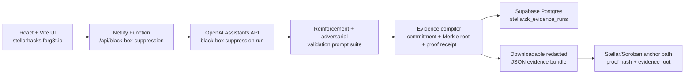

# Forg3t StellarZK

Forg3t StellarZK is a hackathon-focused version of Forg3t Protocol for **Stellar Hacks: Real-World ZK**.

It turns an AI deletion workflow into a private proof receipt and a Stellar-ready attestation package. The product goal is simple: prove that a scoped AI system stopped surfacing sensitive data without publishing the sensitive target itself.

## Why This Exists

Everyone is building AI to remember. Forg3t is building the proof layer for AI to forget.

Record deletion is not enough for enterprise AI. The hard part is proving that an AI workflow no longer retrieves, repeats, or exposes the scoped data. Forg3t compiles that workflow into redacted evidence, commitments, validation signals, and anchor metadata.

## What Works

- Operator-grade React UI based on the Forg3t Avax control-plane design language
- Server-side Netlify Function for live OpenAI Assistant black-box suppression
- Real Assistant policy injection, reinforcement prompts, adversarial prompts, and leak-score measurement
- Optional Supabase persistence for redacted evidence runs through `stellarzk_evidence_runs`
- Real WebCrypto SHA-256 target commitments
- Merkle evidence root generation
- Editable private witness inputs
- Threshold pass/fail proof receipt boundary
- Downloadable JSON evidence bundle
- Local JSON hash verification
- Stellar SDK transaction draft path
- Circom threshold circuit source
- Soroban anchor contract source

No fake transaction hashes, fake OpenAI runs, or fake Supabase inserts are emitted. If a server secret or Stellar testnet signer is not configured, the app says so.

## Tech Architecture



The frontend never receives `OPENAI_API_KEY`, `SUPABASE_SERVICE_ROLE_KEY`, raw Assistant prompts, raw Assistant responses, or the private target after the server-side run. The exported bundle contains commitments, aggregate scores, Merkle leaves, proof receipt metadata, and Stellar anchor metadata.

## Quick Start

```bash
npm install
npm run dev
```

Use the same public Supabase env values as the existing Forg3t app:

```bash
cp .env.example .env
```

Then set:

```bash
VITE_SUPABASE_URL=...
VITE_SUPABASE_ANON_KEY=...
```

For the live OpenAI Assistant runner, set these only in Netlify or a server-side local environment:

```bash
OPENAI_API_KEY=...
OPENAI_ASSISTANT_ID=...
OPENAI_BASE_URL=https://api.openai.com/v1
SUPABASE_URL=...
SUPABASE_SERVICE_ROLE_KEY=...
```

Build:

```bash
npm run build
```

## Optional Stellar Testnet Draft

Create a local `.env` file:

```bash
VITE_STELLAR_TESTNET_SOURCE_SECRET=S...
```

Then restart the dev server. The Stellar tab will create a signed XDR draft using `manageData` operations for:

- `forg3t:evidence`
- `forg3t:proof`

For production, this signing path should move server-side.

## ZK Circuit

The circuit boundary lives in:

```text
circuits/suppression_threshold.circom
```

It proves that the measured post-unlearning leak score is less than or equal to the public maximum while binding:

- target commitment
- evidence root
- measured score
- threshold score

The live Assistant path converts failed black-box validation attempts into `measuredLeakScoreBps`, then binds that score to the same public signal boundary.

## Supabase Evidence Table

The migration lives in:

```text
supabase/migrations/20260628000100_create_stellarzk_evidence_runs.sql
```

It creates `public.stellarzk_evidence_runs` with RLS enabled. Stored rows contain only redacted proof data:

- evidence hash
- evidence root
- target commitment
- proof hash
- Assistant id hash
- aggregate leak and validation scores
- redacted JSON bundle

## Soroban Contract

The Stellar anchor contract lives in:

```text
contracts/forg3t_zk_anchor
```

It stores a proof hash, evidence root, target commitment, threshold, measured score, and timestamp. It rejects anchors when the measured score exceeds the threshold.

## Submission Notes

The full DoraHacks package is in:

```text
docs/dorahacks-submission.md
```
